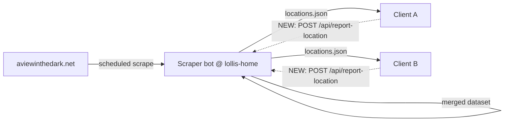

# Design: Crowdsourced Location Reporting ("Report-Back")

Status: **Implemented (v1)** on branches `feature/crowdsourced-location-reporting`
(RBC-Map-Modular) and `feature-crowdsourced-locations` (Discord-Scraper). Pending: deploy +
live test, and a served schema for non-mover building kinds (see "Known limitations").

## Implementation status

| Piece | Where | Status |
|-------|-------|--------|
| Preference + first-run prompt + `client_id` | `rbc_community_map.py`, `constants.py`, `imports.py` | ✅ |
| Learner emits insert/coord-change for all kinds; batched off-thread POST | `rbc_community_map.py` (`_upsert_building`, `_flush_reports`) | ✅ |
| `POST /api/report-location` (validate + inbox + cooldown-gated trigger) | `Discord-Scraper/api/wsgi/wsgi_handler.py` | ✅ |
| Bot drains inbox + merges guild/shop; retains other kinds | `Discord-Scraper/rbc-discord-scraper.py` (`merge_reports_inbox`) | ✅ |
| Serve `community_buildings.json` (non-movers) | `Discord-Scraper/api/wsgi/wsgi_handler.py` | ✅ |
| Client pulls community buildings + merges into local tables + redraws | `rbc_community_map.py` (`fetch_and_merge_community_buildings`, `refresh_map_data_from_db`) | ✅ |

### Deployment / config notes

- **Inbox path must agree** between the WSGI handler and the bot. WSGI writes
  `API_DIR/reports_inbox.json`; the bot defaults to `<dir of OUTPUT_FILE>/reports_inbox.json`.
  These match when `OUTPUT_FILE` is the served `locations.json` in `API_DIR` (the documented
  setup). If the bot's `OUTPUT_FILE` lives elsewhere, set **`REPORTS_INBOX_FILE`** in the bot's
  `.env` to the WSGI path explicitly.
- Optional bot `.env` keys: `REPORTS_INBOX_FILE`, `COMMUNITY_EXTRAS_FILE`, `REPORT_TTL_HOURS`
  (default 6).
- The endpoint pokes `trigger_update` at most once per `COOLDOWN_MINUTES` (shares
  `last_trigger_time` with `/refresh`), so a burst of reports causes at most one scrape/merge
  per window. The bot's existing `trigger_watcher` → `scrape_all` → `merge_reports_inbox` →
  `write_output` closes the loop; the map client then pulls the new `last_updated` via the
  cooldown timestamp guard.

### Known limitations (v1)

- **(Resolved 2026-09-01)** Non-mover kinds (banks/taverns/transits/arenas/graves/lairs/
  alchemy) are now **served** at `GET /api/community_buildings.json` and **pulled down** by the
  client (`fetch_and_merge_community_buildings`), which inserts new ones into the local building
  tables (insert-if-absent by name/column/row) and redraws the map (`refresh_map_data_from_db`)
  on both the startup and manual-update paths. `locations.json` still carries the **movers**
  (guilds/shops); the two data sets are fetched together. Verified end-to-end on the live
  server (bank+pub report → `community_buildings.json` → served → client merge).
- Movers now update locally on any observed coordinate difference; a bad DOM parse could
  overwrite a good local coord. `_infer_col_row_from_dom` + server-side row validation gate
  this, but there is no multi-client quorum yet (v2, §6).

---

Original design follows.
Scope: let every running RBC Map client push locations it discovers on the game page
back to the scraper bot, so the bot's shared dataset updates in real time as players
walk past buildings — rather than depending only on what
[aviewinthedark.net](https://aviewinthedark.net/) exposes to the scheduled scrape.

Related code:
- Client learner: `learn_buildings_from_html` / `_upsert_building` / `_report_discovered_location` in [rbc_community_map.py](../rbc_community_map.py)
- Class → table map: `BUILDING_CLASS_MAP` in [constants.py](../constants.py)
- Server-side scraper reference: `AVITD_Scrape.py` (in the non-modular repo)

---

## 1. Motivation

The scraper can only see guild/shop locations while AVITD is *revealing* them. Between
reveal cycles those locations are hidden, so `locations.json` carries `NA` coordinates
(this is exactly the "3 guilds / 0 shops" state we confirmed on 2026-09-01). But a player
standing next to a shop can see it right now. If clients report what they see, the bot can
maintain current coordinates continuously instead of only at reveal time.

The client already captures these finds **locally** (`learn_buildings_from_html`). The
missing half is sharing them back. `_report_discovered_location` is a `pass` stub today.

## 2. Data flow



Inbound (bot → clients) already works. This design adds the dotted path (clients → bot)
and the bot's merge of reports into the dataset it serves.

## 3. Server side (repo: `Discord-Scraper`)

> The server lives in the **`Discord-Scraper`** repo (deployed to `lollis-home`):
> - WSGI API: `api/wsgi/wsgi_handler.py` — serves `locations.json`, `/refresh`, legacy tokens.
> - Bot/scraper: `rbc-discord-scraper.py` — the **only** writer of `locations.json`
>   (via `write_output()`); the WSGI handler treats the file read-only and pokes the bot by
>   writing a `trigger_update` file its watcher polls.
>
> **Ingest follows the same file-drop pattern.** `/api/report-location` must NOT write
> `locations.json` directly (the Apache user may lack permission, and two writers race).
> Instead the endpoint appends validated reports to an **inbox file** (locked/atomic, like
> `save_tokens`), and the bot merges the inbox into `self.locations` on its next
> `scrape_all()` cycle — as an additional source alongside AVITD/Discord — then `write_output()`
> persists and bumps `last_updated` as usual. The endpoint may also drop `trigger_update` so a
> report prompts a near-term merge.

### 3.1 Endpoint

```
POST /api/report-location
Content-Type: application/json
```

Accepts either a single report object or a `{"reports": [...]}` batch (clients batch
per page load — see §4.3).

### 3.2 Report object

| Field     | Type   | Notes |
|-----------|--------|-------|
| `kind`    | string | One of the `BUILDING_CLASS_MAP` keys: `bank`, `pub`, `shop`, `transit`, `arena`, `grave`, `lair`, `alchemy`. (Guilds arrive as `kind` derived from the guild span class — see §4.1.) |
| `name`    | string | Canonical, normalized name (`normalize_building_name`). |
| `column`  | string | e.g. `"Kraken"`. |
| `row`     | string | e.g. `"45th"`, or `"NCL"` / `"WCL"` edge tokens. |
| `observed_at` | string | UTC `"%Y-%m-%d %H:%M:%S UTC"` — when the client saw it. |
| `client_id` | string | Opaque per-install id (see §6, abuse). Not the user's email or any PII. |
| `app_version` | string | For triage. |

Example:

```json
{
  "reports": [
    {"kind":"shop","name":"Discount Magic","column":"Kraken","row":"45th",
     "observed_at":"2026-09-01 17:02:11 UTC","client_id":"a1b2c3","app_version":"modular-2026.09"}
  ]
}
```

### 3.3 Response

```json
{"status":"ok","accepted":1,"rejected":0,
 "results":[{"name":"Discount Magic","action":"updated"}]}
```

`action` ∈ `inserted` | `updated` | `unchanged` | `rejected` (+ `reason`). Clients treat
any 2xx as success and only log the body; they must not depend on it.

### 3.4 Validation (reject, don't crash)

- `kind` in the allowed set; `name` non-empty after normalization.
- `column` in the known column list, `row` in the known row list (or `NCL`/`WCL`).
  Reuse the same `columns` / `rows` reference tables the client uses.
- `observed_at` parseable and not absurdly future/past (e.g. within ±1 day).
- Rate-limit per `client_id` and per IP (see §6).

### 3.5 Merge semantics — **the important part**

Two families behave differently:

- **Fixed fixtures** (`bank`, `pub`, `transit`, `arena`, `grave`, `alchemy`): identity is
  `(name, column, row)`. These effectively never move. A report is a *confirmation*:
  insert if unknown, otherwise bump a `last_confirmed` timestamp. Optionally require N
  independent confirmations before publishing an unknown one (anti-vandalism).
- **Movers** (`shop`, `guild`): identity is `name`; the **location changes every cycle**.
  A report is authoritative for "where is this right now": update `column`/`row` and a
  `current_since` timestamp whenever the observed location differs from stored. This is
  the whole point of report-back — it keeps movers current while AVITD has them hidden.
- **`lair` (userbuildings)**: player-created, transient. Identity `(name, column, row)`;
  support removal/aging (see §7 open questions) since lairs disappear.

Conflicting mover reports (two clients, different coords, close in time): prefer the most
recent `observed_at`; optionally require agreement from ≥2 clients within a short window
before overwriting a scrape-sourced value. Keep it simple first, harden later.

### 3.6 Feeding back into what clients pull

The merged data must surface in `locations.json` (and reflect in the `last_updated` the
`/refresh` cooldown check now relies on — see the 2026-09 timestamp-guard change). Options:

- **A (simplest):** report handler writes straight into the same store the scraper writes,
  and bumps `last_updated`. Next `locations.json` GET carries the crowsourced coords.
- **B:** keep crowdsourced data in a side table and merge at serve time, so a scrape can't
  clobber a fresher crowd report (and vice-versa) without a rule.

Recommendation: start with **A** but stamp each record's `source` (`scrape` | `report`)
and `last_updated` so B remains possible later.

## 4. Client side (this repo)

### 4.1 Make the learner emit report events for **insert OR coordinate change**, all types

Today `_upsert_building` returns `bool` ("was a brand-new row inserted"), and reporting is
gated on that + `cls in ("shop","guild")`. Per the decision, we want **all** building
types, and we want an **update** (coords filled or changed) to count as reportable — not
just brand-new names. The pre-seeded shop/guild name lists mean "new name" almost never
fires, so update-detection is essential.

Change `_upsert_building` to return an action instead of a bool:

```python
# returns one of: "inserted", "updated", None  (None = nothing changed)
def _upsert_building(self, cur, cls, name, col, row) -> str | None:
    ...
    # movers (shops/guilds): update whenever observed coords differ from stored,
    # not only when stored is NA. This also fixes stale coords when a shop relocates.
    if table in ("shops", "guilds"):
        row0 = cur.execute(f"SELECT `Column`, Row FROM {table} WHERE Name=?", (name,)).fetchone()
        if row0 is None:
            cur.execute(f"INSERT INTO {table} (Name, `Column`, Row) VALUES (?,?,?)", (name, col, row))
            return "inserted"
        existing_col, existing_row = row0
        if (existing_col, existing_row) != (col, row):
            cur.execute(f"UPDATE {table} SET `Column`=?, Row=? WHERE Name=?", (col, row, name))
            return "updated"
        return None
    # fixtures: insert if this (name, col, row) is unknown
    ...
        return "inserted" if newly_inserted else None
```

Then report on any non-`None` action, for every `cls`:

```python
action = self._upsert_building(cur, it["cls"], it["name"], it["col"], it["row"])
if action:                      # "inserted" or "updated", any building type
    self._pending_reports.append({**it, "action": action})
```

> ⚠️ Behavior change to call out: movers now update on **any** coordinate difference, not
> only NA → value. That's desired for report-back (a relocated shop should correct), but it
> means a bad DOM parse could overwrite a good coord locally. `_infer_col_row_from_dom`
> validation (col/row against the reference tables) should gate this — reject unparseable
> before it reaches the upsert.

### 4.2 Implement `_report_discovered_location` → batched POST

```python
REPORT_LOCATION_URL = "https://lollis-home.ddns.net/api/report-location"  # constants.py

def _flush_reports(self, reports: list[dict]) -> None:
    # self.location_reporting_enabled is the user preference (see §4.5)
    if not reports or not self.location_reporting_enabled:
        return
    payload = {"reports": [
        {"kind": r["cls"], "name": r["name"], "column": r["col"], "row": r["row"],
         "observed_at": datetime.now(timezone.utc).strftime("%Y-%m-%d %H:%M:%S UTC"),
         "client_id": self._client_id(), "app_version": APP_VERSION}
        for r in reports
    ]}
    try:
        requests.post(REPORT_LOCATION_URL, json=payload, timeout=REPORT_TIMEOUT)
    except requests.RequestException as e:
        logging.info("Location report skipped (will retry next find): %s", e)
```

Must be **fire-and-forget and non-fatal**: reporting failures can never disrupt page flow
(the learner already runs inside a `try/except` in `process_html`). Ideally run the POST
off the UI thread (reuse the worker-thread pattern from `StartupUpdateWorker`) so a slow
network never stutters the map.

### 4.3 Batching & dedupe

- One POST per page load carrying all finds from that page (`_pending_reports`), not one
  POST per building.
- `_seen_buildings` (already present) dedupes within a session so the same
  `(cls, name, col|row)` isn't re-sent every page. Keep it; a coord *change* produces a new
  signature so it re-reports correctly.
- Optional offline queue: on failure, keep `_pending_reports` and retry-merge on the next
  successful flush. v1 can just drop and rely on the next natural sighting.

### 4.4 Privacy / opt-out

- `client_id` is a random UUID generated once and stored in `settings`. **Never** the
  user's email or character name.
- Reporting is gated by a user preference the player can turn **off** (see §4.5). When off,
  `_flush_reports` returns immediately and **no** report ever leaves the machine — the local
  learner (`learn_buildings_from_html`) keeps working, so the user's own map still fills in;
  only the outbound share is suppressed.
- Only building coordinates are ever sent — never character position, coins, or session
  data.

### 4.5 Preferences toggle (required)

The user **must** be able to turn crowdsourced reporting off in preferences. Wire it exactly
like the existing keybind/log-level settings — a checkable `QAction` in the **Settings**
menu, persisted to the `settings` table, restored on startup.

Follow the `toggle_keybind_config` precedent ([rbc_community_map.py:656](../rbc_community_map.py)),
which is the established pattern for a Settings-menu toggle backed by a `settings` row.

**Menu wiring** (in the Settings-menu build, near [rbc_community_map.py:1339](../rbc_community_map.py)):

```python
self.reporting_action = PySide6.QtGui.QAction(
    "Contribute Discovered Locations", self, checkable=True
)
self.reporting_action.triggered.connect(self.toggle_location_reporting)
settings_menu.addAction(self.reporting_action)
# reflect stored value on startup:
self.reporting_action.setChecked(self.location_reporting_enabled)
```

**Handler + load** (mirrors `toggle_keybind_config`):

```python
def toggle_location_reporting(self, enabled: bool) -> None:
    """Enable/disable sending discovered locations to the bot; persist choice."""
    self.location_reporting_enabled = bool(enabled)
    try:
        with sqlite3.connect(DB_PATH) as conn:
            conn.cursor().execute(
                """
                INSERT OR REPLACE INTO settings (setting_name, setting_value)
                VALUES ('locations_reporting_enabled', ?)
                """,
                (1 if enabled else 0,),
            )
            conn.commit()
    except sqlite3.Error as exc:
        logging.error("Failed to save reporting preference: %s", exc)

def load_location_reporting_setting(self) -> None:
    """Read the reporting preference on startup (default ON if unset)."""
    try:
        with sqlite3.connect(DB_PATH) as conn:
            row = conn.cursor().execute(
                "SELECT setting_value FROM settings WHERE setting_name = 'locations_reporting_enabled'"
            ).fetchone()
        self.location_reporting_enabled = True if row is None else bool(int(row[0]))
    except (sqlite3.Error, ValueError, TypeError):
        self.location_reporting_enabled = True
```

`_flush_reports` (§4.2) checks `self.location_reporting_enabled` instead of a module-level
constant, so the toggle takes effect immediately without a restart.

**Default via first-run prompt (implemented):** rather than a silent hardcoded default, the
app asks once. On startup, `load_location_reporting_setting` flags
`_reporting_pref_was_unset` when no preference row exists (true first run, or upgrade from a
version without the toggle); `_finalize_setup` then shows `prompt_first_run_reporting_choice`
— a Yes/No dialog explaining what is shared — and persists the answer, so it never asks
again. Closing the dialog takes the privacy-preserving path. The menu toggle stays the way
to change the choice later. (Implemented in [rbc_community_map.py](../rbc_community_map.py);
constants in [constants.py](../constants.py); `client_id` + preference live in the `settings`
table.)

## 5. Constants / config to add

| Name | Where | Purpose |
|------|-------|---------|
| `REPORT_LOCATION_URL` | constants.py | ingest endpoint |
| `REPORT_TIMEOUT` | constants.py | small (e.g. 5s) |
| `APP_VERSION` | constants.py | triage tag |
| `locations_reporting_enabled` | settings table | user opt-out toggle, surfaced in the Settings menu (§4.5) |
| `client_id` | settings table | anonymous install id |

## 6. Trust & abuse

Crowdsourced writes are attack surface. Minimum bar for v1:

- Rate-limit per `client_id` and per source IP.
- Server-side validation of every field against the reference column/row tables (§3.4).
- `source` + `last_updated` stamped on every record so a bad wave can be identified and
  rolled back.
- Consider a lightweight shared token/HMAC so random internet clients can't spam the route
  (the app already talks only to `lollis-home`). Not a secret worth much, but raises the bar.

Deferred (v2): confirmation quorum (N clients agree before publishing a fixture), reputation
weighting, moderation queue for unknown names.

## 7. Open questions

1. **Guild movers:** guilds also move per cycle like shops — confirm identity is `name`
   and that overwriting scrape data with a report is acceptable.
2. **Lair aging:** lairs disappear. Do we age them out (TTL since `last_confirmed`), or
   require explicit "gone" reports? Clients can't easily report absence.
3. **Store A vs B (§3.6):** is it OK for a crowd report to overwrite a fresh scrape value,
   or must scrape always win within its own reveal window?
4. **Auth:** tokenless + rate-limit, or add a shared HMAC?
5. **`last_updated` interaction:** should a crowd report bump the same `last_updated` the
   new cooldown guard compares against? If yes, clients will pull each other's reports on
   the next refresh — desirable, but confirm the semantics.

## 8. Suggested rollout

1. Server: build `/api/report-location` with validation + store A + `source` stamping.
2. Client: `_upsert_building` returns action; add `_flush_reports`; wire batched reporting
   for **all** building types; add opt-out toggle + `client_id`.
3. Ship reporting **disabled by default** for one release to observe volume/quality on the
   server, then flip default on.
4. Add quorum/moderation (v2) once real traffic is understood.
